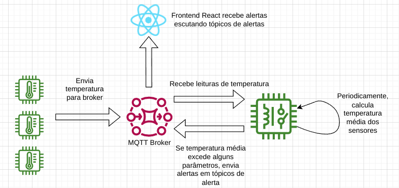
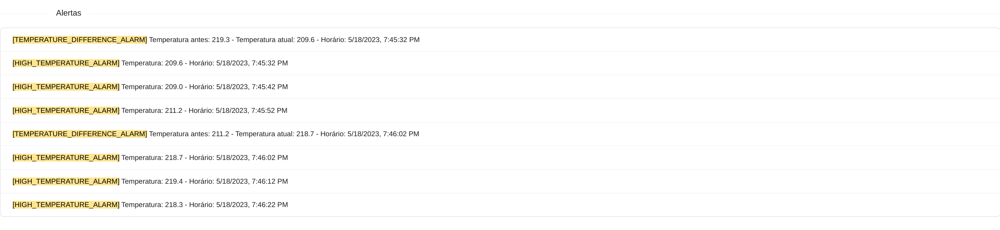
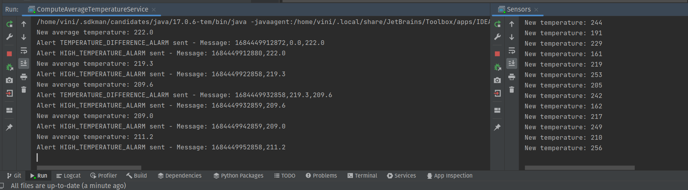

# Aplicação demonstrando uso de MQTT com Paho & Mosquitto

O objetivo dessa aplicação é demonstrar um cenário onde temos sensores de temperatura (produtores) que enviam sua temperatura para um
broker MQTT (Mosquitto), e essas mensagens são consumidas por um serviço que monitora a temperatura média dos sensores.
Caso a temperatura média exceda um valor de referência, ou mude mais de 5 unidades, iremos disparar mensagens de alerta.
As mensagens de alertas são consumidas por uma aplicação React, que se conecta ao broker MQTT e se inscreve nos tópicos 
de alertas.

O diagrama abaixo ilustra como o sistema está organizado.



# Executando a aplicação

0. Clone o projeto
1. Para executar o projeto, primeiramente é necessário ter o mosquitto em execução. Para executá-lo, podemos usar o docker.
Portanto, na raiz do projeto execute o comando abaixo: 

```docker run -it --rm -p 2883:2883 -p 9001:9001 -v ./docker/mosquitto.conf:/mosquitto/config/mosquitto.conf eclipse-mosquitto```

2. Importe o projeto na IDE ou editor de sua preferência
3. Inicie o sensor (`Sensors.java`)
4. Inicie o serviço de cálculo de média de temperatura (`ComputeAverageTemperatureService.java`)
5. Uma vez que os serviços estão em execução, é possível executar a aplicação react para acompanhar os alertas.
6. Primeiramente, entre na pasta `alerts` e execute o comando `yarn` para instalar as dependências
7. Com as dependências instaladas, basta executar o comando `yarn start` para iniciar a aplicação react.

O resultado esperado é que a aplicação inicie a execução normalmente e você possa ver os alertas como no print abaixo.



